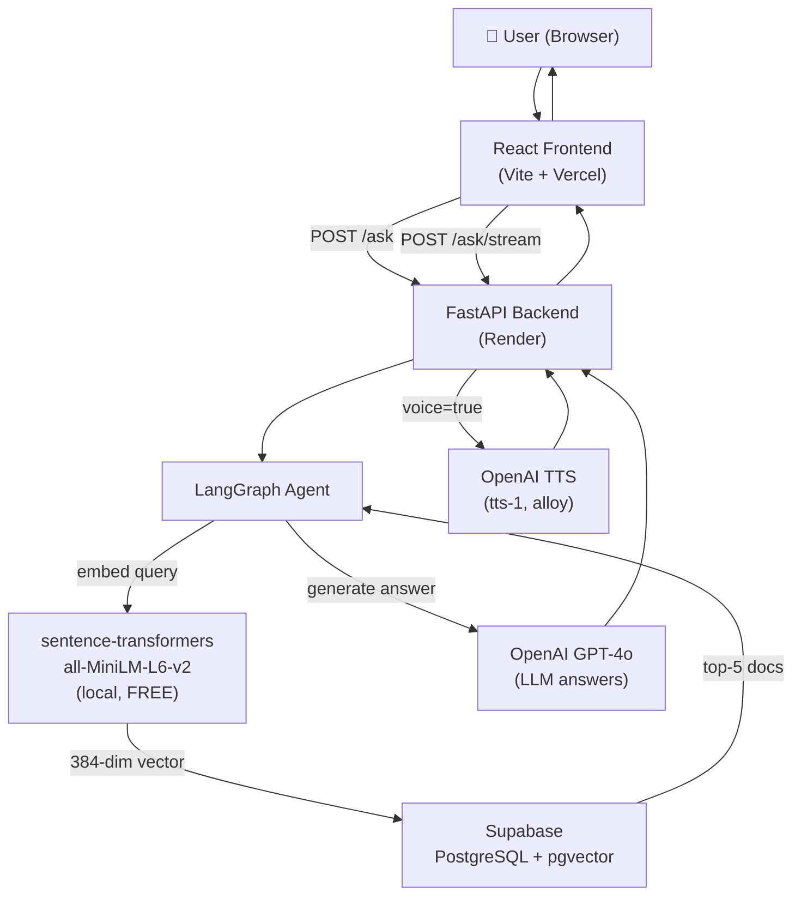

# Python Q&A Assistant

> A RAG-powered Python programming Q&A assistant using Stack Overflow data, LangGraph agentic pipeline, GPT-4o, and open-source embeddings — with a real-time streaming React frontend.

---

## Architecture



---

## Local Setup

### Prerequisites
- Python 3.10+
- Node.js 18+
- A [Supabase](https://supabase.com) project (free tier)
- OpenAI API key

---

### Backend

```bash
# 1. Create and activate venv
cd "Python Programming Q&A Assistant"
python -m venv venv
venv\Scripts\activate        # Windows
# source venv/bin/activate  # macOS/Linux

# 2. Install dependencies
pip install -r backend/requirements.txt

# 3. Configure environment
cd backend
copy .env.example .env
# Edit .env with your OPENAI_API_KEY, SUPABASE_URL, SUPABASE_SERVICE_KEY

# 4. Set up Supabase (one-time)
#    → Run supabase_setup.sql in your Supabase SQL Editor

# 5. Run data ingestion (one-time, ~30-60 min for 50k records)
python -m rag.ingest

# 6. Start the API server
uvicorn main:app --reload --port 8000
```

API docs available at: http://localhost:8000/docs

---

### Frontend

```bash
cd frontend
cp .env.example .env          # set VITE_API_URL=http://localhost:8000
npm install
npm run dev
```

Frontend runs at: http://localhost:5173

---

## Data Ingestion

```bash
# From backend/ with venv active
python -m rag.ingest
```

- Reads `question_answer.json` (455K records from Stack Overflow)
- Filters Python-related records via keyword matching
- Embeds with `all-MiniLM-L6-v2` (384-dim, runs locally, **no API cost**)
- Batch-upserts into Supabase `documents` table in batches of 100
- Idempotent: skips already-ingested records
- Set `INGEST_LIMIT=50000` in `.env` to cap at 50K records

---

## Running Tests

```bash
cd backend
pytest tests/ -v
```

8 tests covering all endpoints.

---

## API Endpoints

| Method | Path | Description |
|--------|------|-------------|
| `GET` | `/health` | API health + version info |
| `POST` | `/ask` | Q&A with optional TTS audio |
| `POST` | `/ask/stream` | SSE streaming Q&A |
| `GET` | `/sources` | Retrieve matching docs without answering |

---

## Live Deployed URLs

| Service | URL |
|---------|-----|
| Frontend (Vercel) | _Add after deployment_ |
| Backend API (Render) | _Add after deployment_ |
| API Docs | `{backend-url}/docs` |

---

## Design Decisions

### Why LangGraph?
Stateful agent with conditional routing — classify → retrieve → grade → generate. Each step is a distinct node, making it easy to inspect, debug, and extend. The grading node filters out irrelevant retrieved docs before generation, preventing hallucination grounding.

### Why open-source embeddings (all-MiniLM-L6-v2)?
- **455K records** → OpenAI embeddings would require rate-limit management and non-trivial API costs
- `sentence-transformers` runs **entirely locally** — zero API cost, no rate limits, ~50ms per batch
- 384-dim vectors are sufficient for semantic search quality at this scale
- Same model is used at both ingestion and query time — consistent vector space

### Why pgvector on Supabase?
- No extra infrastructure needed (PostgreSQL already managed)
- HNSW index gives fast approximate nearest-neighbor search
- Free tier is sufficient for <1M vectors
- `match_documents` RPC encapsulates cosine similarity cleanly

### Why SSE streaming?
Better perceived performance — users see the first tokens within ~500ms instead of waiting 5-10s for the full GPT-4o response.

---

## Scaling Plan for 100+ Concurrent Users

| Layer | Strategy |
|-------|----------|
| **FastAPI** | Async handlers + `uvicorn` workers managed by `gunicorn` (4-8 workers) |
| **Embeddings** | Model loaded once per worker; thread-pooled with `asyncio.run_in_executor` |
| **Supabase** | Connection pooling via PgBouncer (built-in on Supabase) |
| **Caching** | Redis (TTL 1h) for repeated questions — skip LLM if cache hit |
| **Horizontal scaling** | Multiple Render instances behind load balancer |
| **OpenAI rate limits** | Batch embedding requests; exponential backoff via `tenacity` |
| **Vector search** | HNSW index handles ~1000 QPS; add read replicas for higher load |

**Estimated cost at 100 req/min:**
- OpenAI GPT-4o: ~$0.30/1K tokens × avg 800 tokens/req × 6K req/hr ≈ **$1.44/hr**
- OpenAI TTS: ~$0.015/1K chars × 500 chars × 20% voice requests × 6K req/hr ≈ **$0.09/hr**
- Supabase: Free tier (500MB DB, 500K vector ops/mo) — **upgrade at >200K req/day**
- Render: Starter plan $7/mo per instance; 2 instances for HA ≈ **$14/mo**
